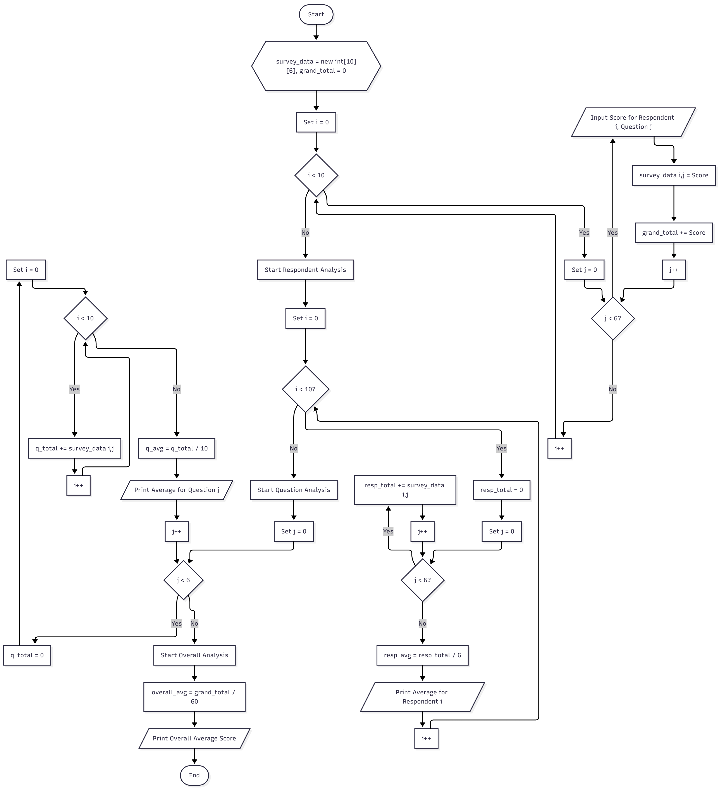

# Array 2D Practicum

Simple overview of use/purpose.

## Description

Basic Programming Practicum: Array Assignment

## Getting Started

### Question 2.1 (Declare, Initialize, and Display 2-Dimensional Array)
1. Do array elements have to be filled in sequentially starting from the 0th index? Please
explain!<br/>
    No, because arrays in java support random access, meaning you can read or write to any element at any valid index.

2. Why is there a null in the list of audience names?<br/>
    The null appears because the element audience[3][1] was never assigned a value.
3. Complete the audience list in step 4 so that it looks like the following program code
   ```java
      audience[0][0] = "Amin";
      audience[0][1] = "Bena";
      audience[1][0] = "Candra";
      audience[1][1] = "Dela";
      audience[2][0] = "Eka";
      audience[2][1] = "Farhan";
      audience[3][0] = "Gisel";
      audience[3][1] = "Hana";
   ```
   
4. Explain the function of audience.length and audience[0].length! <br/> Do audience[0].length, audience[1].length, audience[2].length, and audience[3].length have the same value? Why? <br/>
    - audience.length gives you the length of the outer array, while audience[0].length gives you the length of that inner array
    - audience[0].length, audience[1].length, audience[2].length, audience[3].length have the same value because the array was declared as new String[4][2], meaning Java creates 4 inner arrays, and all of them are given the same length of 2.


5. Modify the program code in step 4 to display the length of each row in the array using a for loop. Compile, run, then commit <br/>
    ```java
    System.out.println(audience.length);

    for (int i = 0; i < audience.length; i++) {
      System.out.println("Length of row " + (i + 1) + ": " + audience[i].length);
    }
    ```
6. Modify the program code in step 5 to display the length of each row in the array using a foreach loop. Compile, run, then commit. <br/>
    ```java
        for (String[] rowAudience : audience) {
            System.out.println("Length of row: " + rowAudience.length);
        }
    ```

7. In your opinion, what are the advantages and disadvantages of foreach loop compared to for loop? <br/>
* For loop:
  * Advantage: Is flexible, you can skip elements, you can access the index
  * Disadvantage: Requires explicit initialization, condition, and update statements 
* Foreach Loop:
  * Advantage: Is designed for arrays, making looping over an array easier
  * Less control than for loop, no index access

8. What is the max row index for the audience array? <br/>
  The max row index is 3
9. What is the max column index for the audience array? <br/>
  The mac columnn index is 1
10. Add program code to display the audience’s name on the 3rd line using a for loop. Compile, run, then commit. <br/>
  ```java
  System.out.println("Audiences in row 3: ");
    for (int i = 0; i < audience[2].length; i++) {
      System.out.println(audience[2][i]);
    }
  ```
11. Modify the code in question number 10 to repeat using a foreach loop. Compile, run, then commit. <br/>
  ```java
  System.out.println("Audiences in row 3: ");
    for (String name : audience[2]) {
      System.out.println(name);
    }
  ```
12. Modify the program code in question number 11 again to display the audience’s name for each line. Compile and run the program then observe the results, then commit.
  ```java
  System.out.println("All audiences by row: ");
    for (int i = 0; i < audience.length; i++) {
      System.out.println("Audience in row " + (i + 1) + ": " + String.join(", ", audience[i]));
    }
  ```
13. What is the function of String.join()?<br/>
  To combine a list of strings into a single string using a specified delimiter

### Question 2.2 (Utilizing Scanners and Loops for Input and Output on 2-Dimensional Arrays)
1. Should the array elements from the scanner be filled in sequentially starting from the 0th index? Please explain! <br/>
  No, because arrays in java support random access, meaning you can read or write to any element at any valid index.
2. Modify the program code to provide the following menu options:
   - Menu 1: Input audience data
   - Menu 2: Show audience list
   - Menu 3: Exit
    ```java
        while (true) {
          System.out.print("Enter a name: ");
          name = scanner.next();
          System.out.print("Enter row number: ");
          row = scanner.nextInt();
          System.out.print("Enter column number: ");
          col = scanner.nextInt();
          audience[row - 1][col - 1] = name;
          System.out.print("Are there any other audiences to be added (Y/N): ");
          String next = scanner.next();
          if (next.equalsIgnoreCase("n")) {
            break;
          }
        }

        System.out.println("All audiences by row: ");
        for (int i = 0; i < audience.length; i++) {
          System.out.println("Audience in row " + (i + 1) + ": " + String.join(", ", audience[i]));
        }
    ```
3. Modify the program code to handle if the seat row/column number is not available<br/> we add this code block
```java
      if (audience[row - 1][col - 1] != null) {
        System.out.println("Seat already taken! Please choose another seat.");
        continue;
      }
```
4.  In menu 1, modify the program code to give a warning if the selected seat is already occupied by other audiences, then display a command to enter rows and columns again<br/> we add this code block below the row and column input
  ```java
      while (audience[row - 1][col - 1] != null) {
        System.out.print("Seat already taken! Please choose another seat.\n");
        System.out.print("Enter row number: ");
        row = scanner.nextInt();
        System.out.print("Enter column number: ");
        col = scanner.nextInt();
      }
  ```
5. In menu 2, if the seat is empty, replace null with *** <br/> we add this code block
  ```java
    for (int i = 0; i < audience.length; i++) {
      for (int j = 0; j < audience[i].length; j++) {
        if (audience[i][j] == null) {
          audience[i][j] = "***";
        }
      }
    }
  ```

### Question 2.3 (2-Dimensional Array with Different Row Lengths)
1. Add the following program code: <br/>
  ```java
      for (int i = 0; i < myNumbers.length; i++) {
        System.out.println(Arrays.toString(myNumbers[i]));
      }
  ```
2. What is the function of Arrays.toString()? <br/>
   To Convert arrays into human readable string
3. What is the default value for elements in an array with the data type int? <br/>
   The default value is 0
4. Add the following program code: <br/>
   ```java
    for (int i = 0; i < myNumbers.length; i++) {
      System.out.println("Length of row " + (i + 1) + ": " + myNumbers[i].length);
    }
   ```
5. The myNumbers array has a different length for each row. How to make the length for each row the same? Can the array length be modified? <br/>
   1. instead of declaring each row's length,
    ```java
      int[][] myNumbers = new int[3][];
      myNumbers[0] = new int[5];
      myNumbers[1] = new int[3];
      myNumbers[2] = new int[1];
    ```
    we can declare the array to have the same length in one line of code
    ```java
      int[][] myNumbers = new int[3][5];
    ```
   2. No, since array length is immutable, it cannot be modified.
### Question 2.4 (SIAKAD Case Study)
1. What happens if the number of students and courses changes? Modify the SIAKAD program code to accommodate the dynamic number of students and courses.<br/>
   1. If thw number of students and courses change, then the user's input would be different and have to input a different amount of data.
   2. Change the array declaration to: <br/> 
    ```java
      System.out.print("Enter number of students: ");
      int numStudents = sc.nextInt();
      System.out.print("Enter number of courses: ");
      int numCourses = sc.nextInt();
      int[][] score = new int[numStudents][numCourses];
    ```    
### Assignment
