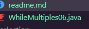
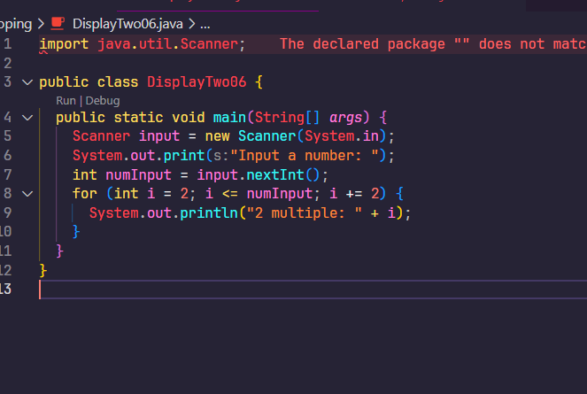
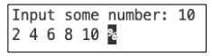
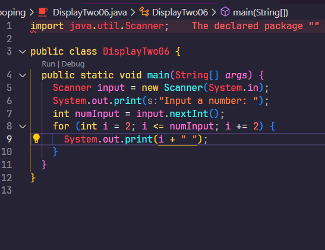

# Looping Practicum

Simple overview of use/purpose.

## Description

Basic Programming Practicum: Looping Assignment

## Getting Started

### Question 2.1 (Counting Multiples Using FOR)
1. There are 3 main components in FOR loop. Based on experiment 1 above, identify and
explain these 3 components! 
   
   Because it only checks if uktLunas is true or false
2. Explain how the following code works!
```for (int i = 1; i <= 50; i++) {
        if (i % multiple == 0) {
          sum = sum + i;
          counter++;
        }
      }
  ```
first, it loops carrying the variable i = 1. then it checks if the remainder of i / multiple is 0, if it is then the sum var is going to be added with i and then the counter is added by 1.

3. Modify the existing code by adding a new variable to calculate the average of all the specified multiples!
```
import java.util.Scanner;

public class ForMultiples06 {
  public static void main(String[] args) {
    Scanner sc = new Scanner(System.in);
    System.out.print("Input the multiple: ");
    int sum = 0, counter = 0;
    int multiple = sc.nextInt();
    for (int i = 1; i <= 50; i++) {
      if (i % multiple == 0) {
        sum = sum + i;
        counter++;
      }
    }
    double avg = (double) sum / counter;
    System.out.printf("There are %d number that are multiples of %d between 1 and 50%n", counter, multiple);
    System.out.printf("the sum of all multiples of %d between 1 and 50 is %d%n", multiple, sum);
    System.out.printf("the average of all multiples of %d between 1 and 50 is %.2f%n", multiple, avg);
    sc.close();
  }
}

```
4. Create a new Java program file named WhileMultiplesNoAbsen.java



### Question 2.2 (Show Multiplication of 2)
1. Do modification to make the program produce similar result but WITHOUT IF statement. <br />Please insert a screenshot of your code to the report.

  

2. Do modification to make the program print like this following result. Please insert a screenshot of your code to the report.
  
  
   
  

### Question 2.3 (The Triangle)
1. Do a modification on the program therefore your program utilize FOR statement rather than WHILE statement.

```
import java.util.Scanner;

public class TheTriangle06 {
  public static void main(String[] args) {
    Scanner input = new Scanner(System.in);
    System.out.print("Input a number: ");
    int i = 0;
    String s = "";
    int numInput = input.nextInt();
    for (; i < numInput; i++) {
      s += " *";
      System.out.println(s);
    }
  }
}
```

2. Explain the meaning of s += “ *” and why is it possible? 
   
   it adds " *" to the s variable, essentially making it longer for each iteration. eg. * * *...


### Question 2.3 (Calculating Leave Entitlement Using DO-WHILE)
1. What is the use of the BREAK within the loop syntax?
   
    to get out of the loop once the condition in which the break is in is met.


2. Modify the program so that if the number of leave days requested is greater than the remaining entitlement, the program does not stop, allowing the user to enter the number of days according to the entitlement.
   
   ```
    import java.util.Scanner;

    public class DoWhileLeaveEntitlement06 {
      public static void main(String[] args) {
        Scanner input = new Scanner(System.in);
        int leaveEntitlement = 0, numLeave = 0;
        String confirmation = "";
        System.out.print("Input your leave entitlement: ");
        leaveEntitlement = input.nextInt();
        do {
          System.out.print("Do you want to take a leave (y/n)? ");
          confirmation = input.next();
          if (confirmation.equalsIgnoreCase("y")) {
            System.out.print("How many day(s)? ");
            numLeave = input.nextInt();
            if (numLeave <= leaveEntitlement) {
              leaveEntitlement -= numLeave;
              System.out.println("Remaining leave entitlement: " + leaveEntitlement);
            } else {
              System.out.println("You don't have enough leave entitlement");
              System.out.print("Input your leave entitlement: ");
              leaveEntitlement = input.nextInt();
            }
          }
        } while (leaveEntitlement > 0);
      }
    }
   ```
  3. Commit and push the program code to GitHub.<br/>
     <a href="">respect</a>