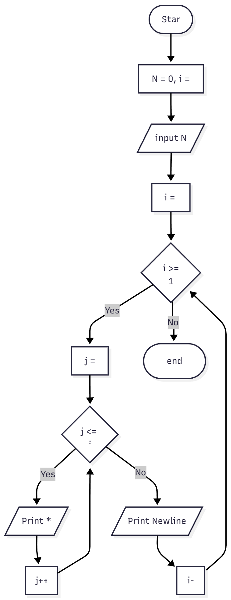
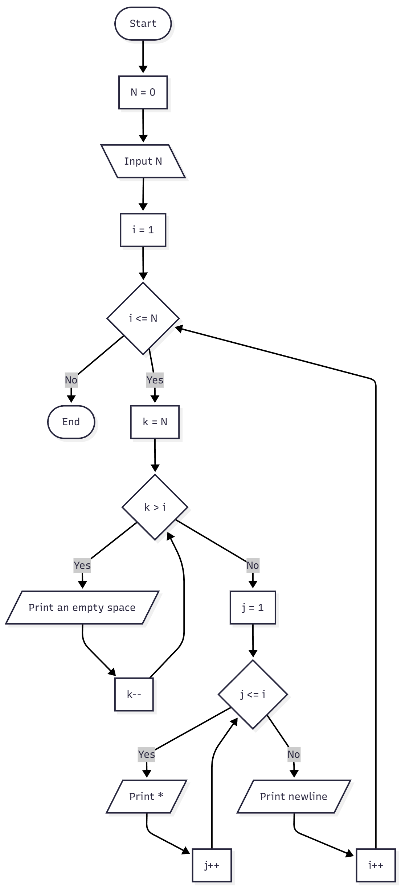

# Looping Practicum

Simple overview of use/purpose.

## Description

Basic Programming Practicum: Looping Assignment

### 2.1 Experiment 1: Loop Review

1.  If in for loop, the initialization i = 1 is changed to i = 0, what is the result? How can It be like that? <br /> it will print out N + 1 stars because we use the condition i <= N which will loop from 0 to N
2.  If in for loop, condition i <= N is changed to i > N, what is the result? How can It be like that? <br /> 
   if N is less than i then it's going to print the stars endlessly, because the condition i++ will add the value of i indefinitely while the condition for stopping is that i > N is false, meaning it will go forever. Otherwise, it's not going to print anything because N is already bigger than i.  
3.  If in for loop, the condition for step i++ is changed to i-- what is the result? How can It be like that? <br /> if we enter a positive value, it's not going to print anything because the condition (i>N) because N is already bigger than i, if N <= 0 then it's going to print out the asterisks because N is less than 1

-----

### 2.2 Experiment 2: Square Star

1.  Pay attention to outer loop. If in for syntax, the initialization iOuter = 1 is changed to iOuter = 0, what is the result? How can it be like that? <br />
  the height is added by 1 because the loop iterates one more time to complete the condition (iOuter <= N)
2.  Return the program to normal with initialization iOuter = 1. Then pay attention to the inner loop. If in for syntax, the initialization i = 1 is changed to i = 0, what is the result? How can it be like that? <br />
  the width is added by 1 because the loop iterates one more time to complete the condition (i <= N)
3.  What is the difference between outer loop and inner loop? <br/>
    Outer Loop: Controls the asterisks to be printed in the Vertical direction

    Inner Loop: Controls the asterisks to be printed in the horizontal direction
4.  Why is it necessary to add the syntax System.out.println(); under inner loop? What will happen if the syntax is omitted?
   it's necessary to change the next asterisks to be printed under the existing one, if it is omitted then it's going to print the asterisks side by side instead of making a square
   <pre>
    * * * * * * * * * * * * * * * * * * * * * * * * * 
    instead of 
    * * * * *
    * * * * *
    * * * * *
    * * * * *
    * * * * *
    </pre>
   

-----

### 2.3 Experiment 3: Triangle Star

1.  Look at the results, does the output produced with a value of N = 5 match the following display?<br/>
   no, it shows
   ```
    * * * * * * * * * * 
   ```

2.  If not, which parts should be improved or added? Describe any parts that need to be improved or added!
    Two modifications are required:

    1.  The outer loop condition `while (i <= N)` should be `while (i < N)` to make the loop execute N times (for i=0, 1, 2, 3, 4).
    2.  A `System.out.println();` command must be added after the inner `while` loop but before the `i++;` to create a new line for each row.

    **Corrected Code:**

    ```java
        System.out.print("Enter the value of N: ");
        int N = sc.nextInt();
        int i = 0;
        while (i < N) {
            int j = 0;
            while (j <= i) { // Changed condition from j < i
                System.out.print("*");
                j++;
            }
            System.out.println(); 
            i++;
        }
    ```
-----

### 2.4 Experiment 4: Guess the Number Quiz

1.  Explain the program flow in Experiment 4! <br/>
    The program uses two nested `do-while` loops.

      * Outer Loop : Controls the ability to "repeat the game". It initializes `menu = 'y'` and repeats as long as the user inputs 'Y' or 'y' at the end .
      * Inner Loop : Controls the guessing process for a single game.
        Inside the outer loop, a new random `number` (1-10) is generated, and `success` is set to `false` . The inner loop then starts. It repeatedly prompts the user to "Guess the number" . It checks if the `answer` equals the `number` and sets the `success` boolean accordingly . The inner loop continues to run as long as `!success` (the guess is wrong) . Once the guess is correct (`success` is `true`), the inner loop terminates, and the program asks the user to repeat the game .

2.  What must be done to discontinue (not repeat) the game? <br/>
    When prompted "Do you want to repeat the game (Y/N)" , the user must input any character that is not 'Y' and not 'y' .

3.  Modify the program above, so that it can display information about: input the guess value entered by the user, whether it is smaller or greater than the answer (number) randomly determined by the computer! <br/>
    ```java
    do {
        System.out.print("Guess the number (1-10): ");
        int answer = input.nextInt();
        input.nextLine();
        
        if (answer < number) {
            System.out.println("Your guess is too small.");
        } else if (answer > number) {
            System.out.println("Your guess is too large.");
        }
        
        success = (answer == number);
    } while (!success);

    System.out.println("Congratulations, your guess was correct!");
    ```

-----

### 2.5 Experiment 5: Filling and Displaying Arrays

1.  Explain the program flow in Experiment 5! <br/>
    The program performs two main operations using nested loops on an array `temps` (5 rows, 7 columns) .

      * Part 1: Data Input
        1.  An outer loop iterates $i$ from 0 to 4 (representing 5 cities) .
        2.  For each city $i$, it prints "City: $i$" .
        3.  An inner loop iterates $j$ from 0 to 6 (representing 7 days) .
        4.  For each day $j$, it prompts "Day $j+1$: ", reads a `double` from the user, and stores it in `temps[i][j]` .
        5.  After the inner loop finishes (all 7 days), it prints a newline .
      * Part 2: Data Display
        1.  A second outer loop iterates $i$ from 0 to 4 (cities) .
        2.  For each city $i$, it prints "City: $i$" .
        3.  A second inner loop iterates $j$ from 0 to 6 (days) .
        4.  It prints the value stored in `temps[i][j]` followed by a space .
        5.  After the inner loop finishes (all 7 temps for that city), it prints a newline .

2.  Modify the program to display an array using foreach! <br/>

    ```java
    int cityIndex = 0;
    for (double[] cityData : temps) {
        System.out.println("City: " + cityIndex);
        for (double dayTemp : cityData) {
            System.out.print(dayTemp + " ");
        }
        System.out.println();
        cityIndex++;
    }
    ```

3.  Modify the program so that it can display the average value for each city! <br/>
    ```java
    for (int i = 0; i < temps.length; i++) {
        System.out.println("City: " + i);
        double sum = 0;
        for (int j = 0; j < temps[0].length; j++) {
            System.out.print(temps[i][j] + " "); 
            sum += temps[i][j];
        }
        System.out.println(); 
        
        double average = sum / temps[0].length;
        System.out.printf("Average for City %d: %.2f\n", i, average);
        System.out.println(); 
    }
    ```

### Assignment
1. Create a program to print a numeric triangle display as below based on the N input (minimum N value is 3). Example N = 5
   ```
        1
       12
      123
     1234
    12345
   ```
   -----
   ```java
      public static void main(String[] args) {
        Scanner sc = new Scanner(System.in);

        System.out.print("Enter the value of N: ");
        int N = sc.nextInt();
        if (N < 3) {
          System.out.println("N should be at least 3.");
          sc.close();
          return;
        }
        for (int i = 1; i <= N; i++) {
          for (int k = N; k > i; k--) {
            System.out.print("  ");
          }
          for (int j = 1; j <= i; j++) {
            System.out.print(j + " ");
          }
          System.out.println();
        }

        sc.close();
      }
   ```
2. Create a program to print the star triangle view shown below based on the N input (minimum N value is 5). Example N = 7 
   ```
    *******
    ******
    *****
    ****
    ***
    **
    *
   ```

   ```java
    public static void main(String[] args) {
      Scanner sc = new Scanner(System.in);

      System.out.print("Enter the value of N: ");
      int N = sc.nextInt();
      if (N < 5) {
        System.out.println("N should be at least 5.");
        sc.close();
        return;
      }

      for (int i = N; i >= 1; i--) {
        for (int j = 1; j <= i; j++) {
          System.out.print("* ");
        }
        System.out.println();
      }

      sc.close();
    }
   ```
3.  Create a program to print a square numeric display like the one below based on N input (minimum N value is 3). Example N = 3 and N = 5
   ```
                5 5 5 5 5
                5       5
    3 3 3       5       5
    3   3       5       5
    3 3 3       5 5 5 5 5
   ```

   ```java
    public static void main(String[] args) {
        Scanner sc = new Scanner(System.in);

        System.out.print("Enter the size of the square (N): ");
        int N = sc.nextInt();
        if (N < 3) {
          System.out.println("N should be at least 3.");
          sc.close();
          return;
        }

        for (int i = 1; i <= N; i++) {
          for (int j = 1; j <= N; j++) {
            if (i == 1 || i == N || j == 1 || j == N) {
              System.out.print(N + " ");
            } else {
              System.out.print("  ");
            }
          }
          System.out.println();
        }

        sc.close();
      }
   ```
4. In 2024, Malang State Polytechnic will host the Porseni national event. There are several sports that are competed in, such as badminton, table tennis, basketball, and volleyball. Each sport sends its 5 best athletes from all polytechnics throughout Indonesia to take part in this biannual event. Create a data storage to display information on the names of athletes from the various branches mentioned in ascending order. 
   ```java
      public static void main(String[] args) {
        Scanner sc = new Scanner(System.in);
        String[][] sports = new String[4][5];
        String[] sportNames = { "Badminton", "Table_Tennis", "Basketball", "Volleyball" };
        for (String sport : sportNames) {
          System.out.println("Enter names of 5 athletes for " + sport + ":");
          for (int i = 0; i < 5; i++) {
            System.out.print("Athlete " + (i + 1) + ": ");
            String name = sc.nextLine();
            switch (sport) {
              case "Badminton":
                sports[0][i] = name;
                break;
              case "Table_Tennis":
                sports[1][i] = name;
                break;
              case "Basketball":
                sports[2][i] = name;
                break;
              case "Volleyball":
                sports[3][i] = name;
                break;
            }
          }

          switch (sport) {
            case "Badminton":
              Arrays.sort(sports[0]);
              break;
            case "Table_Tennis":
              Arrays.sort(sports[1]);
              break;
            case "Basketball":
              Arrays.sort(sports[2]);
              break;
            case "Volleyball":
              Arrays.sort(sports[3]);
              break;
          }

          System.out.println();

        }
        for (String sport : sportNames) {
          System.out.println("\nAthletes in " + sport + ":");
          for (int i = 0; i < 5; i++) {
            switch (sport) {
              case "Badminton":
                System.out.println("Athlete " + (i + 1) + ": " + sports[0][i]);
                break;
              case "Table_Tennis":
                System.out.println("Athlete " + (i + 1) + ": " + sports[1][i]);
                break;
              case "Basketball":
                System.out.println("Athlete " + (i + 1) + ": " + sports[2][i]);
                break;
              case "Volleyball":
                System.out.println("Athlete " + (i + 1) + ": " + sports[3][i]);
                break;
            }
          }
        }
      }
   ```

5. Implement the flowchart of the features you created in the previous theory assignment about nested loops!
   
   a.
   ```
    **********
    *********
    ********
    *******
    ******
    *****
    ****
    ***
    **
    *
   ```

   
   b. 
   ```
               *
              **
             ***
            ****
           *****
          ******
         *******
        ********
       *********
      **********
   ```

   