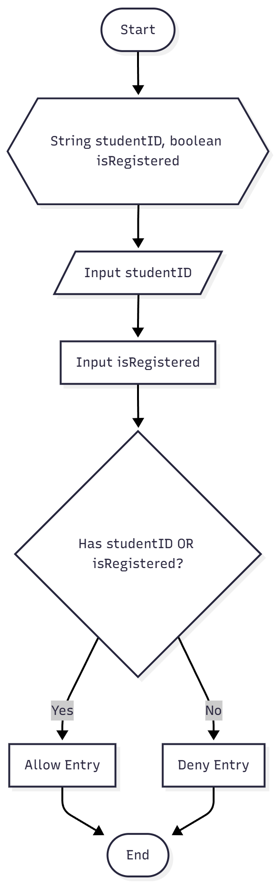
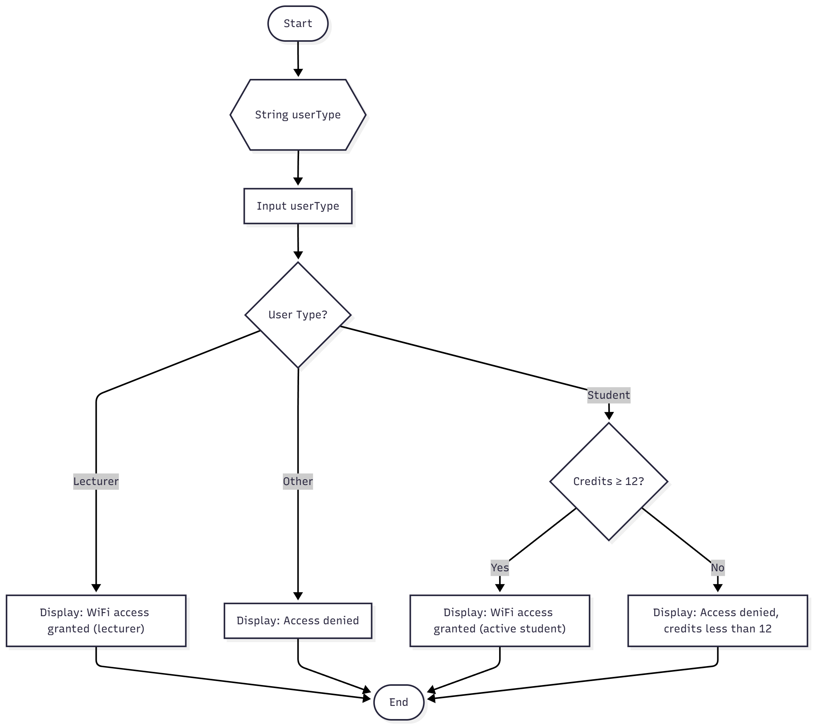

# EXERCISE 1
## 1
- Flowchart



- Pesudocode 
  
```
BEGIN
  DEFINE studentID AS STRING
  DEFINE isRegistered AS BOOLEAN

  INPUT studentID
  INPUT isRegistered

  IF studentID IS TRUE OR isRegistered IS TRUE THEN
    OUTPUT "Entry allowed."
  ELSE
    OUTPUT "Entry denied."
  END IF
END
```
## 2
- Flowchart



- Pesudocode 
  
```
BEGIN
  DEFINE userType AS STRING
  DEFINE credits AS INTEGER

  SET userType = INPUT userType

  IF userType IS "lecturer" THEN
    OUTPUT "WiFi access granted (lecturer)"
  ELSE IF userType IS "student" THEN
    SET credits = get_user_credits()
    IF credits >= 12 THEN
      OUTPUT "WiFi access granted (active student)"
    ELSE
      OUTPUT "Access denied, credits less than 12"
    END IF
  ELSE
    OUTPUT "Access denied"
  END IF
END
```