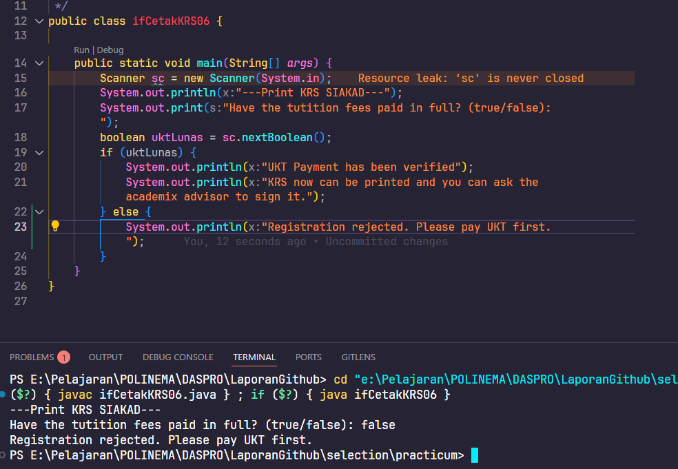

# Selection Practicum

Simple overview of use/purpose.

## Description

Basic Programming Practicum: Selection Assigment

## Getting Started

### Question 2.1
1. Why doesn't the check in the IF structure involve conditions with relational operators?
   
   Because it only checks if uktLunas is true or false
2. When the program is run, then you enter the value false , what is the result?

   Doesn't print anything
3. The system needs to provide information that if the user enters a false value , the output
will be "Registration rejected. Please pay UKT first." Modify the program by adding an
ELSE!

   
1. Commit and push your modifications to Github with the message “Test Modification
1”